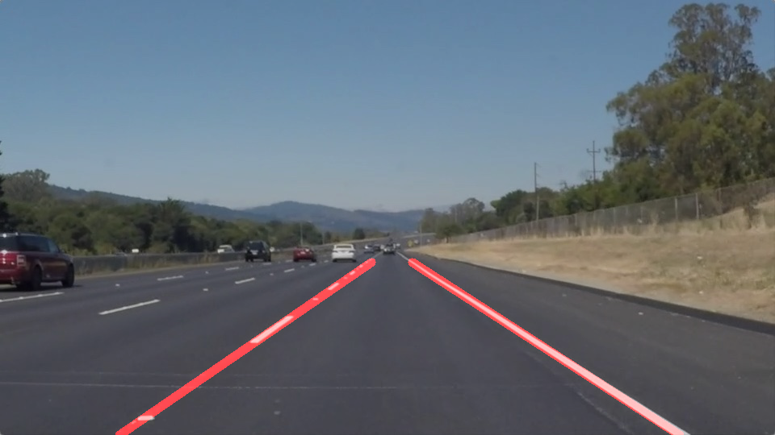
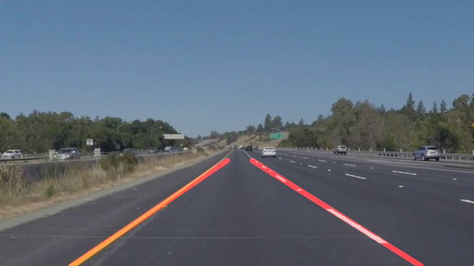

# Finding Lane Lines on the Road

The goals / steps of this project are the following:
* Make a pipeline that finds lane lines on the road
* Reflect on your work in a written report

## Reflection

### Pipeline descripton

My pipeline consisted of 6 steps.

1. Convert the input image to grayscale.
2. Apply Gaussian noise transform.
3. Apply Canny transform.
4. Apply an image mask which only keeps the specified polygon.
5. Apply hough transform and returns an image with hough lines drawn. 
6. Compose hough lines image with the input image.

In order to draw a single line on the left and right lanes, I modified the draw_lines() function by the following steps.

1. Separate line segments by their slope `((y2-y1)/(x2-x1))` to decide which segments are part of the left line vs. the right line. 
2. Apply `numpy.polyfit` to each line segment.
3. Extrapolate to the top and bottom of the each lane.

#### Generated images

#### Drawing lane lines on videos

You can view the video version.

* <a href="test_videos_output/solidWhiteRight.mp4">test_videos_output/solidWhiteRight.mp4</a>
* <a href="test_videos_output/solidYellowLeft.mp4">test_videos_output/solidYellowLeft.mp4</a>

### Shortcomings

I tried my lane finding pipeline on the video `test_videos_output/challenge.mp4`. But the lane line is not drawn 
as intended. The top position of the left line and right line is not successfully deteced. 

### Possible improvements

Possible improvements would be to 

1. Adjust hough transform parameters. 
2. Define a four sided polygon to mask for creating a masked edges by a dynamic way instead of the current static one.
